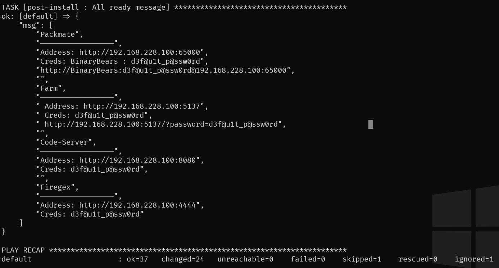

# AD-vulnbox-vagrant
Self Hosted vulnbox solution 

## Prerequisites
- [Vagrant](https://developer.hashicorp.com/vagrant/install)
- [Virtualbox](https://www.virtualbox.org/wiki/Downloads)
- x86 OS 

## How to:
Запуск состоит из двух этапов. Создание виртуальной машины и её настройка с помощью Ansible.

Для запуска достаточно ввести команду ниже
```bash
vagrant up 
```
Выполнится создание и настройка vulnbox. В конце настройки отобразится сообщение Ansible.


Отдельно настройку можно выполнить командой 
```bash
vagrant provision
```
Остановка машины осуществляется командой
```bash
vagrant halt 
```

## Сompatibility
| System  | Arch | Backend       | Status                                   |
|---------|------|---------------|------------------------------------------|
| Windows | x86  | vbox          | +                                        |
| MacOS   | x86  | vbox          | +                                        |
| MacOS   | ARM  | разные        | Протетсировал различные бекенды, -       |
| Linux   | x86  | vbox          |                                          |

## TODO:
- Протестировать на линуксе со стадартным провайдером